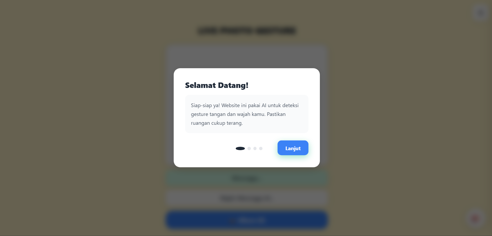

# 🎭 Live Photo Gesture

Website interaktif yang menggunakan **AI MediaPipe** untuk mendeteksi gesture tangan dan ekspresi wajah secara real-time melalui kamera browser.



---

## ✨ Fitur Utama

### 🖐️ Deteksi Gesture Tangan
| Gesture | Fungsi |
|---------|--------|
| ✋ 5 Jari | Normal Mode |
| ✌️ 2 Jari (Telunjuk + Tengah) | Blur Foto |
| ☝️ 1 Jari (Telunjuk) | Mode Telunjuk |
| ✊ Kepal | Mode Lawan |
| 🤟 Metal (Jempol + Kelingking) | Mode Metal |
| ❤️ Sarangheyo (Jempol + Telunjuk bersatu) | Love Mode |

### 😊 Deteksi Ekspresi Wajah
| Ekspresi | Fungsi |
|----------|--------|
| 😲 Mulut Terbuka | Mode Ngangap |
| 😡 Cemberut | Mode Cemberut |
| 🤭 Tutup Mulut | Mode Rahasia |

### 📷 Fitur Foto
- **Hitung mundur 3-2-1** saat ambil foto
- **Album foto** dengan preview
- **Download** dan **Share** langsung
- **Upload otomatis** ke Supabase Storage

### 🎨 Customisasi Warna
- **10 preset warna** berbeda
- **Custom color picker** untuk warna apapun
- **6 gradient** menarik
- **Tersimpan otomatis** di localStorage

---

## 📸 Screenshots

### Halaman Utama


### Deteksi Gesture


### Album Foto


### Customisasi Warna


---

## 🚀 Cara Menggunakan

### 1. Clone Repository
```bash
git clone https://github.com/willsyh/live-photo-gesture.git
cd live-photo-gesture
```

### 2. Konfigurasi Supabase
- Buat account di [Supabase](https://supabase.com)
- Buat project baru
- Buat 2 bucket:
  - `audio-assets` (Public)
  - `photo-assets` (Public)
- Copy **Project URL** dan **Anon Key**
- Edit `config.js`:
```javascript
const CONFIG = {
    SUPABASE_URL: 'https://your-project.supabase.co',
    SUPABASE_ANON_KEY: 'your-anon-key-here',
    AUDIO_BUCKET: 'audio-assets',
    PHOTO_BUCKET: 'photo-assets'
};
```

### 3. Buka Website
Buka `index.html` di browser (Chrome/Edge/Firefox)

> ⚠️ **Penting:** Website membutuhkan akses kamera. Gunakan HTTPS atau localhost untuk testing.

---

## 🛠️ Tech Stack

- **Frontend:** HTML5, CSS3, JavaScript
- **AI Detection:** Google MediaPipe (Hands + Face Mesh)
- **Storage:** Supabase Storage
- **Styling:** Custom CSS dengan CSS Variables

---

## 📁 Struktur Project

```
live-photo-gesture/
├── index.html          # Main HTML
├── style.css           # Styles
├── script.js           # JavaScript logic
├── config.js           # Supabase config (git ignored)
├── config.example.js   # Config template
├── .gitignore
└── screenshots/        # Screenshot images
```

---

## 🎯 Gesture Detection Details

Website menggunakan **21 landmark tangan** dan **468 landmark wajah** dari MediaPipe untuk mendeteksi:

- **Jari terbuka/tertutup** berdasarkan posisi Y landmark
- **Jarak jempol-telunjuk** untuk gesture Sarangheyo
- **Posisi mulut** untuk deteksi ekspresi
- **Debounce system** untuk mencegah flickering

---

## ⚙️ Konfigurasi Lanjutan

### Threshold Gesture (di script.js)
```javascript
const HAND_MODE_THRESHOLD = 2;  // Frame stabil sebelum mode berubah
// Sarangheyo threshold: 0.22
```

### Upload Audio
Semua file audio di-host di Supabase Storage. Untuk menambah audio baru:
1. Upload ke bucket `audio-assets`
2. Update URL di `index.html`

---

## 👨‍💻 Dibuat Oleh

**Will** - [GitHub](https://github.com/willsyh)

---

## 📄 License

Project ini bebas digunakan untuk pembelajaran dan pengembangan.

---

## 🙏 Credits

- [Google MediaPipe](https://mediapipe.dev/) - AI Detection
- [Supabase](https://supabase.com/) - Backend Storage
